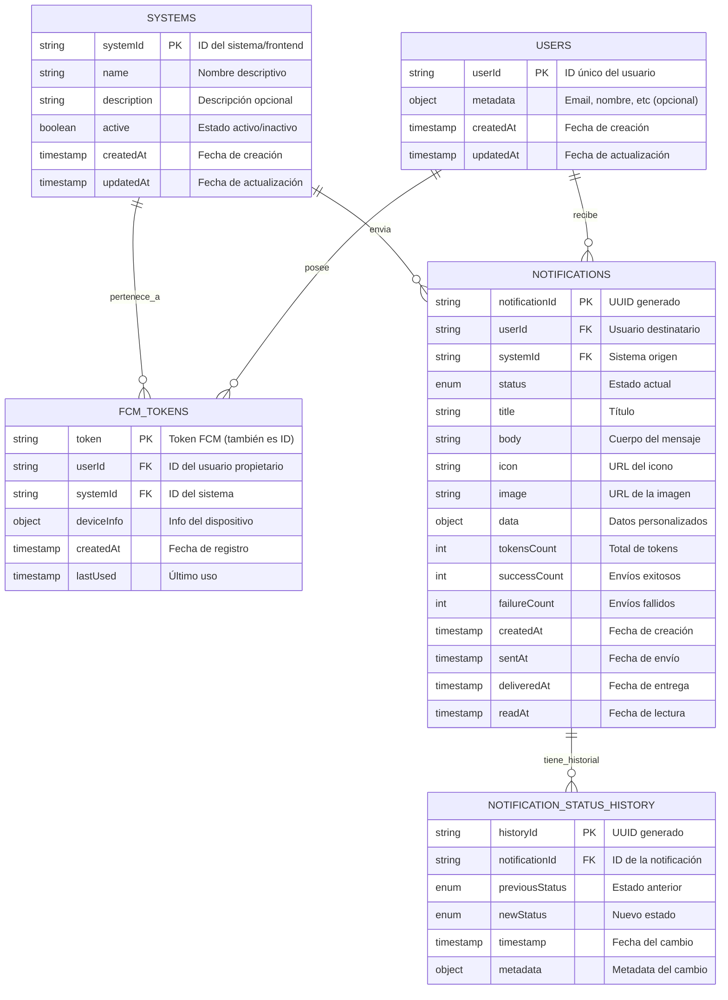

# 📊 Diagrama Entidad-Relación (ER) - Sistema de Notificaciones Push

## Diagrama ER Visual



---

## Diagrama de Relaciones Detallado (ASCII)

```
┌─────────────────────────────────────────────────────────────────────────────┐
│                          SISTEMA DE NOTIFICACIONES PUSH                      │
└─────────────────────────────────────────────────────────────────────────────┘

                        ┌─────────────────────────┐
                        │       SYSTEMS           │
                        │─────────────────────────│
                        │ • systemId (PK)         │
                        │ • name                  │
                        │ • description           │
                        │ • active                │
                        │ • createdAt             │
                        │ • updatedAt             │
                        └────────┬────────────────┘
                                 │
                    ┌────────────┼────────────┐
                    │ 1:N        │ 1:N        │
                    ↓            ↓            │
        ┌──────────────────┐  ┌──────────────┐  
        │   FCM_TOKENS     │  │     USERS    │  
        │──────────────────│  │──────────────│  
        │ • token (PK)     │←─┤ • userId (PK)│  
        │ • userId (FK)    │  │ • metadata   │  
        │ • systemId (FK)  │  │ • createdAt  │  
        │ • deviceInfo     │  │ • updatedAt  │  
        │ • createdAt      │  └──────┬───────┘  
        │ • lastUsed       │         │          
        └──────────────────┘         │ 1:N      
                                     ↓          
                            ┌─────────────────────┐
                            │   NOTIFICATIONS     │
                            │─────────────────────│
                            │ • notificationId(PK)│
                            │ • userId (FK)       │
                            │ • systemId (FK)  ←──┘
                            │ • status            │
                            │ • title             │
                            │ • body              │
                            │ • icon              │
                            │ • image             │
                            │ • data              │
                            │ • tokensCount       │
                            │ • successCount      │
                            │ • failureCount      │
                            │ • createdAt         │
                            │ • sentAt            │
                            │ • deliveredAt       │
                            │ • readAt            │
                            └──────────┬──────────┘
                                       │
                                       │ 1:N
                                       ↓
                    ┌──────────────────────────────────────┐
                    │  NOTIFICATION_STATUS_HISTORY         │
                    │──────────────────────────────────────│
                    │ • historyId (PK)                     │
                    │ • notificationId (FK)                │
                    │ • previousStatus                     │
                    │ • newStatus                          │
                    │ • timestamp                          │
                    │ • metadata                           │
                    └──────────────────────────────────────┘
```

---

## Descripción de Relaciones

### 1. USERS → FCM_TOKENS (1:N)
**Relación:** Un usuario puede tener múltiples tokens FCM
- Cada token representa un dispositivo/navegador registrado
- Un usuario puede tener diferentes tokens en diferentes sistemas
- Permite notificaciones a múltiples dispositivos del mismo usuario

```sql
USERS.userId ←→ FCM_TOKENS.userId (One-to-Many)
```

---

### 2. SYSTEMS → FCM_TOKENS (1:N)
**Relación:** Un sistema puede tener múltiples tokens FCM
- Cada token está asociado a un sistema específico
- Permite separación de notificaciones por frontend
- Un token solo recibe notificaciones del sistema al que pertenece

```sql
SYSTEMS.systemId ←→ FCM_TOKENS.systemId (One-to-Many)
```

---

### 3. USERS → NOTIFICATIONS (1:N)
**Relación:** Un usuario puede recibir múltiples notificaciones
- Todas las notificaciones tienen un destinatario (userId)
- Permite histórico completo de notificaciones por usuario

```sql
USERS.userId ←→ NOTIFICATIONS.userId (One-to-Many)
```

---

### 4. SYSTEMS → NOTIFICATIONS (1:N)
**Relación:** Un sistema puede enviar múltiples notificaciones
- Cada notificación indica qué sistema la envió
- Permite filtrar notificaciones por origen
- Facilita auditoría por sistema

```sql
SYSTEMS.systemId ←→ NOTIFICATIONS.systemId (One-to-Many)
```

---

### 5. NOTIFICATIONS → NOTIFICATION_STATUS_HISTORY (1:N)
**Relación:** Una notificación puede tener múltiples cambios de estado
- Cada cambio de estado se registra como un nuevo registro
- Permite trazabilidad completa del ciclo de vida
- Orden cronológico de estados: pending → sent → delivered → read

```sql
NOTIFICATIONS.notificationId ←→ NOTIFICATION_STATUS_HISTORY.notificationId (One-to-Many)
```

---

## Cardinalidades Completas

```
SYSTEMS (1) ←──→ (N) FCM_TOKENS     [One-to-Many]
SYSTEMS (1) ←──→ (N) NOTIFICATIONS  [One-to-Many]

USERS (1) ←──→ (N) FCM_TOKENS       [One-to-Many]
USERS (1) ←──→ (N) NOTIFICATIONS    [One-to-Many]

NOTIFICATIONS (1) ←──→ (N) NOTIFICATION_STATUS_HISTORY  [One-to-Many]
```

**Nota:** USERS y SYSTEMS NO tienen relación directa. La relación se establece a través de:
- **FCM_TOKENS**: Conecta un usuario con un sistema específico mediante sus tokens
- **NOTIFICATIONS**: Identifica qué usuario recibe una notificación de qué sistema

---

## Índices Recomendados para Firestore

### Colección: `systems`
- ✓ `active` - Para listar sistemas activos

### Colección: `users`
- ✓ `userId` (automático) - Búsqueda por ID de usuario

### Colección: `fcm_tokens`
- ✓ **Compuesto:** `userId` + `systemId` - Para obtener tokens de usuario en un sistema
- ✓ `lastUsed` - Para limpieza de tokens antiguos
- ✓ `systemId` - Para listar tokens por sistema

### Colección: `notifications`
- ✓ **Compuesto:** `userId` + `systemId` + `createdAt` - Para listar notificaciones de usuario
- ✓ **Compuesto:** `userId` + `systemId` + `status` - Para filtrar por estado
- ✓ `status` - Para estadísticas globales
- ✓ `createdAt` - Para ordenamiento temporal

### Colección: `notification_status_history`
- ✓ **Compuesto:** `notificationId` + `timestamp` - Para historial ordenado

---

## Flujo de Datos Completo

```
┌──────────────┐
│  FRONTEND    │
│ (Cliente)    │
└──────┬───────┘
       │ 1. Registro
       │ POST /register-token
       │ { userId, systemId, token }
       ↓
┌──────────────────────────────────────────────────────────────┐
│                         BACKEND API                          │
├──────────────────────────────────────────────────────────────┤
│                                                              │
│  ┌──────────────────────────────────────────────────────┐  │
│  │ 1. Guardar en FCM_TOKENS                            │  │
│  │    - token = PK                                      │  │
│  │    - userId, systemId, deviceInfo                    │  │
│  └──────────────────────────────────────────────────────┘  │
│                          ↓                                   │
│  ┌──────────────────────────────────────────────────────┐  │
│  │ 2. Actualizar/Crear USERS                           │  │
│  │    - Agregar systemId a systemIds[]                  │  │
│  └──────────────────────────────────────────────────────┘  │
│                                                              │
└──────────────────────────────────────────────────────────────┘
       ↓
┌──────────────────────────────────────────────────────────────┐
│                      FIRESTORE DB                            │
├──────────────────────────────────────────────────────────────┤
│  [fcm_tokens/token123]                                       │
│  [users/user123]                                             │
└──────────────────────────────────────────────────────────────┘

═══════════════════════════════════════════════════════════════

┌──────────────┐
│  SERVIDOR    │
│ (Backend)    │
└──────┬───────┘
       │ 2. Enviar Notificación
       │ POST /send-notification
       │ { userId, systemId, notification }
       ↓
┌──────────────────────────────────────────────────────────────┐
│                         BACKEND API                          │
├──────────────────────────────────────────────────────────────┤
│                                                              │
│  ┌──────────────────────────────────────────────────────┐  │
│  │ 1. Crear NOTIFICATION (status: pending)             │  │
│  │    - Genera notificationId (UUID)                    │  │
│  └──────────────┬───────────────────────────────────────┘  │
│                 ↓                                            │
│  ┌──────────────────────────────────────────────────────┐  │
│  │ 2. Crear NOTIFICATION_STATUS_HISTORY                │  │
│  │    - previousStatus: null                            │  │
│  │    - newStatus: pending                              │  │
│  └──────────────┬───────────────────────────────────────┘  │
│                 ↓                                            │
│  ┌──────────────────────────────────────────────────────┐  │
│  │ 3. Buscar FCM_TOKENS                                │  │
│  │    WHERE userId = X AND systemId = Y                 │  │
│  └──────────────┬───────────────────────────────────────┘  │
│                 ↓                                            │
│  ┌──────────────────────────────────────────────────────┐  │
│  │ 4. Enviar a Firebase Cloud Messaging                │  │
│  │    - Envía a todos los tokens encontrados            │  │
│  └──────────────┬───────────────────────────────────────┘  │
│                 ↓                                            │
│  ┌──────────────────────────────────────────────────────┐  │
│  │ 5. Actualizar NOTIFICATION                          │  │
│  │    - status: sent (si exitoso)                       │  │
│  │    - tokensCount, successCount, failureCount         │  │
│  └──────────────┬───────────────────────────────────────┘  │
│                 ↓                                            │
│  ┌──────────────────────────────────────────────────────┐  │
│  │ 6. Crear NOTIFICATION_STATUS_HISTORY                │  │
│  │    - previousStatus: pending                         │  │
│  │    - newStatus: sent                                 │  │
│  └──────────────────────────────────────────────────────┘  │
│                                                              │
└──────────────────────────────────────────────────────────────┘
       ↓
┌──────────────┐
│   FCM        │
│ (Firebase)   │
└──────┬───────┘
       │ Entrega al dispositivo
       ↓
┌──────────────┐
│  FRONTEND    │
│ (Cliente)    │
└──────┬───────┘
       │ 3. Actualizar Estado
       │ POST /update-notification-status
       │ { notificationId, status: "delivered" }
       ↓
┌──────────────────────────────────────────────────────────────┐
│                         BACKEND API                          │
├──────────────────────────────────────────────────────────────┤
│  ┌──────────────────────────────────────────────────────┐  │
│  │ 1. Actualizar NOTIFICATION                          │  │
│  │    - status: delivered                               │  │
│  │    - deliveredAt: now()                              │  │
│  └──────────────┬───────────────────────────────────────┘  │
│                 ↓                                            │
│  ┌──────────────────────────────────────────────────────┐  │
│  │ 2. Crear NOTIFICATION_STATUS_HISTORY                │  │
│  │    - previousStatus: sent                            │  │
│  │    - newStatus: delivered                            │  │
│  └──────────────────────────────────────────────────────┘  │
└──────────────────────────────────────────────────────────────┘
```

---

## Ejemplo de Datos en las Tablas

### Tabla: SYSTEMS
```
┌───────────────────┬──────────────────────────┬────────────────────────┬────────┐
│ systemId          │ name                     │ description            │ active │
├───────────────────┼──────────────────────────┼────────────────────────┼────────┤
│ portal-sistemas   │ Portal de Sistemas       │ Sistema principal      │ true   │
│ admin-panel       │ Panel de Administración  │ Panel administrativo   │ true   │
│ mobile-app        │ Aplicación Móvil         │ App móvil              │ true   │
└───────────────────┴──────────────────────────┴────────────────────────┴────────┘
```

### Tabla: USERS
```
┌─────────┬─────────────────────────────────┬──────────────────────┐
│ userId  │ metadata                        │ createdAt            │
├─────────┼─────────────────────────────────┼──────────────────────┤
│ user123 │ {email: "user@example.com"}     │ 2025-10-24 10:00:00  │
│ user456 │ {email: "admin@example.com"}    │ 2025-10-24 11:00:00  │
└─────────┴─────────────────────────────────┴──────────────────────┘
```

**Nota:** Los usuarios NO almacenan los sistemas a los que pertenecen.
La relación usuario-sistema se identifica en `fcm_tokens` y `notifications`.

### Tabla: FCM_TOKENS
```
┌─────────────────────┬─────────┬─────────────────┬──────────────────────────┐
│ token (PK)          │ userId  │ systemId        │ deviceInfo               │
├─────────────────────┼─────────┼─────────────────┼──────────────────────────┤
│ fcm_token_abc123... │ user123 │ portal-sistemas │ {browser: "Chrome"}      │
│ fcm_token_def456... │ user123 │ mobile-app      │ {platform: "Android"}    │
│ fcm_token_ghi789... │ user456 │ admin-panel     │ {browser: "Firefox"}     │
└─────────────────────┴─────────┴─────────────────┴──────────────────────────┘
```

### Tabla: NOTIFICATIONS
```
┌──────────────────┬─────────┬─────────────────┬───────────┬────────────────┬──────────────┐
│ notificationId   │ userId  │ systemId        │ status    │ title          │ body         │
├──────────────────┼─────────┼─────────────────┼───────────┼────────────────┼──────────────┤
│ uuid-001         │ user123 │ portal-sistemas │ read      │ Nueva tarea    │ Tarea #123   │
│ uuid-002         │ user123 │ mobile-app      │ delivered │ Recordatorio   │ Reunión 3pm  │
│ uuid-003         │ user456 │ admin-panel     │ sent      │ Alerta         │ Error en...  │
└──────────────────┴─────────┴─────────────────┴───────────┴────────────────┴──────────────┘
```

### Tabla: NOTIFICATION_STATUS_HISTORY
```
┌────────────┬──────────────────┬─────────────────┬──────────────┬───────────────────┐
│ historyId  │ notificationId   │ previousStatus  │ newStatus    │ timestamp         │
├────────────┼──────────────────┼─────────────────┼──────────────┼───────────────────┤
│ hist-001   │ uuid-001         │ null            │ pending      │ 2025-10-24 10:00  │
│ hist-002   │ uuid-001         │ pending         │ sent         │ 2025-10-24 10:01  │
│ hist-003   │ uuid-001         │ sent            │ delivered    │ 2025-10-24 10:02  │
│ hist-004   │ uuid-001         │ delivered       │ read         │ 2025-10-24 10:05  │
│ hist-005   │ uuid-002         │ null            │ pending      │ 2025-10-24 11:00  │
│ hist-006   │ uuid-002         │ pending         │ sent         │ 2025-10-24 11:01  │
│ hist-007   │ uuid-002         │ sent            │ delivered    │ 2025-10-24 11:02  │
└────────────┴──────────────────┴─────────────────┴──────────────┴───────────────────┘
```

---

## Restricciones y Validaciones

### Integridad Referencial

1. **FCM_TOKENS → USERS**
   - `userId` debe existir en USERS (se crea automáticamente si no existe)

2. **FCM_TOKENS → SYSTEMS**
   - `systemId` debe ser un sistema válido

3. **NOTIFICATIONS → USERS**
   - `userId` debe existir en USERS

4. **NOTIFICATIONS → SYSTEMS**
   - `systemId` debe existir en SYSTEMS

5. **NOTIFICATION_STATUS_HISTORY → NOTIFICATIONS**
   - `notificationId` debe existir en NOTIFICATIONS

### Reglas de Negocio

1. **Un token FCM es único** por dispositivo (PK = token)
2. **Un usuario puede tener múltiples tokens** en el mismo sistema
3. **Un usuario puede pertenecer a múltiples sistemas**
4. **Los estados de notificación son secuenciales**: pending → sent → delivered → read
5. **Cada cambio de estado se registra** en el historial
6. **Los tokens inválidos se eliminan** automáticamente al fallar el envío

---

## Consultas Comunes

### 1. Obtener todos los tokens de un usuario en un sistema
```typescript
WHERE userId = "user123" AND systemId = "portal-sistemas"
Colección: fcm_tokens
```

### 2. Obtener notificaciones no leídas de un usuario
```typescript
WHERE userId = "user123" AND systemId = "portal-sistemas" AND status IN ["sent", "delivered"]
Colección: notifications
ORDER BY createdAt DESC
```

### 3. Obtener historial completo de una notificación
```typescript
WHERE notificationId = "uuid-001"
Colección: notification_status_history
ORDER BY timestamp ASC
```

### 4. Contar notificaciones por estado
```typescript
WHERE userId = "user123" AND systemId = "portal-sistemas"
GROUP BY status
Colección: notifications
```

---

## Resumen de Claves

### Claves Primarias (PK)
- `SYSTEMS.systemId`
- `USERS.userId`
- `FCM_TOKENS.token` ← (el token mismo es la PK)
- `NOTIFICATIONS.notificationId` ← (UUID generado)
- `NOTIFICATION_STATUS_HISTORY.historyId` ← (UUID generado)

### Claves Foráneas (FK)
- `FCM_TOKENS.userId` → `USERS.userId`
- `FCM_TOKENS.systemId` → `SYSTEMS.systemId`
- `NOTIFICATIONS.userId` → `USERS.userId`
- `NOTIFICATIONS.systemId` → `SYSTEMS.systemId`
- `NOTIFICATION_STATUS_HISTORY.notificationId` → `NOTIFICATIONS.notificationId`

---

## 📊 Índices Recomendados en Firestore

Para optimizar las consultas, se recomienda crear los siguientes índices:

### **Colección: `fcm_tokens`**
```
- userId (Ascending) + systemId (Ascending)
- token (Ascending)  ← CRÍTICO: Para detectar duplicados al registrar
```

### **Colección: `notifications`**
```
- userId (Ascending) + systemId (Ascending) + createdAt (Descending)
- userId (Ascending) + systemId (Ascending) + status (Ascending) + createdAt (Descending)
```

### **Colección: `notification_status_history`**
```
- notificationId (Ascending) + timestamp (Ascending)
```

---

## 🔄 Lógica Anti-Duplicados

### **Problema Resuelto:**
Si un usuario inicia sesión en múltiples pestañas/dispositivos simultáneamente, todas intentarán registrar el mismo token FCM, creando documentos duplicados.

### **Solución Implementada:**
Al guardar un token sin ID, el sistema:
1. **Busca si el token ya existe** en la colección `fcm_tokens`
2. **Si existe**: Reutiliza ese documento, actualiza userId/systemId/deviceInfo
3. **Si NO existe**: Crea un nuevo documento con ID autogenerado

```typescript
// Buscar si el token ya existe
WHERE token == token
LIMIT 1

// Si existe → reutilizar documento existente
// Si no existe → crear nuevo con .doc()
```

### **Beneficios:**
- ✅ **1 token = 1 documento** (sin duplicados)
- ✅ **Múltiples pestañas** reciben el mismo ID
- ✅ **Notificaciones únicas** (no se duplican)
- ✅ **Caché consistente** en frontend

---

## 🎯 Conclusión

Este diseño relacional permite:
- ✅ **Escalabilidad multi-sistema**: Fácil agregar nuevos frontends
- ✅ **Trazabilidad completa**: Historial de todos los estados
- ✅ **Gestión eficiente**: Índices optimizados para consultas rápidas
- ✅ **Sin duplicados**: Reutilización inteligente de tokens FCM
- ✅ **Integridad de datos**: Relaciones bien definidas
- ✅ **Flexibilidad**: Soporte para múltiples dispositivos por usuario


┌─────────────────────────────────────────────────────────┐
│  Frontend envía: POST /subscription/save-token          │
│  { userId, systemId, token, deviceInfo, id? }           │
└────────────────────────┬────────────────────────────────┘
                         │
                         ▼
            ┌────────────────────────┐
            │   ¿Se envió un ID?     │
            └────────┬───────────────┘
                     │
        ┌────────────┼────────────┐
        │ SÍ         │            │ NO
        ▼            │            ▼
┌───────────────┐    │    ┌──────────────────────┐
│ Buscar doc    │    │    │ Buscar si el token   │
│ por ID        │    │    │ ya existe            │
│               │    │    │ WHERE token == token │
│ ¿Existe?      │    │    │ LIMIT 1              │
└───┬───────────┘    │    └────────┬─────────────┘
    │                │             │
    │ Sí             │    ┌────────┼──────────┐
    ▼                │    │ Existe │          │ No existe
┌───────────────┐    │    ▼        │          ▼
│ Actualizar    │    │  ┌─────────┐│    ┌────────────┐
│ ese documento │◄───┼──┤Reutilizar││    │ Crear nuevo│
└───────────────┘    │  │documento ││    │ doc()      │
                     │  └─────────┘│    └────────────┘
                     │             │          │
                     └─────────────┴──────────┘
                                   │
                                   ▼
                     ┌──────────────────────────┐
                     │ Guardar/Actualizar:      │
                     │ - userId                 │
                     │ - systemId               │
                     │ - token                  │
                     │ - deviceInfo             │
                     │ - lastUsed = now()       │
                     └────────────┬─────────────┘
                                  │
                                  ▼
                     ┌──────────────────────────┐
                     │ Response: {              │
                     │   id: docId,             │
                     │   isNewRegistration,     │
                     │   data: {...}            │
                     │ }                        │
                     └──────────────────────────┘